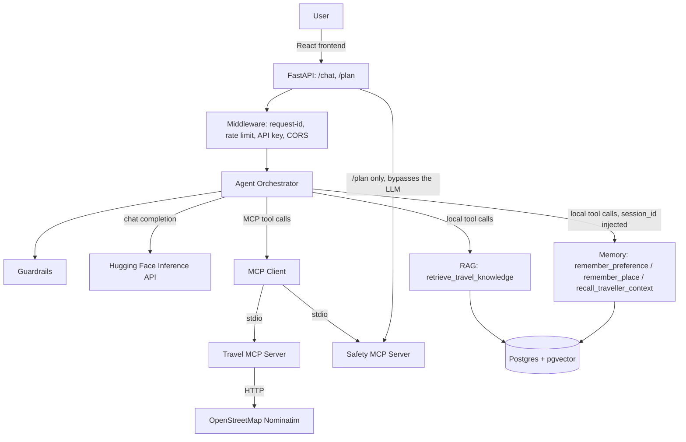

# Architecture

## Current system (phase 1)

`/plan` (see [planning.md](planning.md)) reuses this exact same orchestrator
for the itinerary text, plus one direct, non-LLM-mediated call to Safety
MCP for guaranteed emergency info — the one deliberate exception to "the
LLM decides which tools to call."

Request flow for `POST /chat`:

1. Middleware assigns a request ID, checks the API key (dev mode skips this
   if `API_KEY` is left at its default), and enforces a per-client rate limit.
2. The orchestrator validates the message (`app/agent/guardrails.py`) and
   checks it for prompt-injection patterns.
3. It builds a system prompt listing every available tool — MCP tools and
   local tools (RAG, Memory) combined — and calls the LLM.
4. If the LLM's reply parses as a tool call, arguments are validated against
   the tool's JSON schema, then executed — via the MCP client for
   Travel/Safety, or directly for local tools. Memory tools additionally
   get `session_id` injected by the orchestrator from the validated
   request — never from the LLM's tool-call arguments (see
   `docs/memory.md`). The result is fed back to the LLM. This repeats up
   to `MAX_TOOL_ITERATIONS` times.
5. Once the LLM returns plain text, it's returned to the user. A safety
   disclaimer is attached deterministically (not LLM-written) if the topic
   or any tool used was safety-related.

## Not yet built

- **Real auth** — a single shared API key, not per-user identity. Memory's
  `session_id` is whatever the client sends — not tied to an authenticated
  user yet.
- **Persisted trips** — a generated plan lives in the browser's session
  state, not a database table; only preferences/places are durable, via
  Memory.

Deliberately not built: Redis (nothing needs it — see `docs/decisions.md`),
a third MCP server for RAG or Memory (see `docs/rag.md` and
`docs/memory.md` for why both are local tools instead).

## Why this shape

The agent process (`app/`) never talks to travel/safety data directly — it
only knows how to call MCP tools whose schemas it discovered at startup.
That boundary is deliberate: see [mcp.md](mcp.md) for the reasoning, and
[decisions.md](decisions.md) for the log of alternatives considered.
